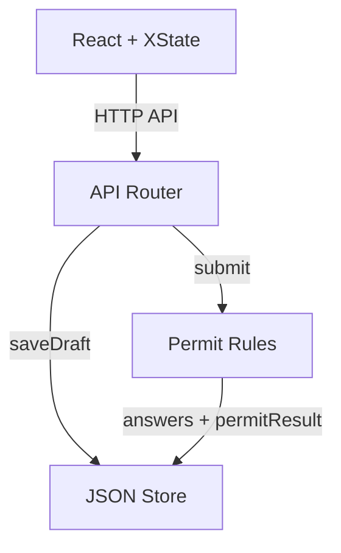
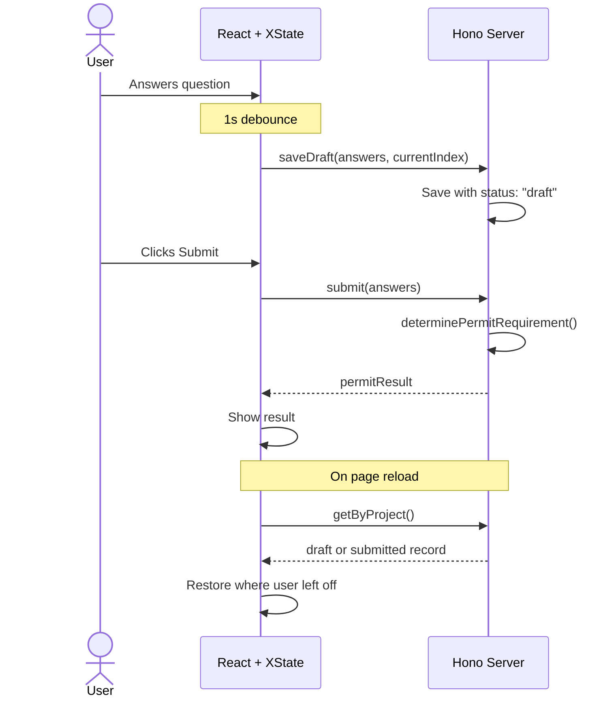

# Architecture

## System Overview

On submit, the router passes answers + project location to `determinePermitRequirement()`, which returns one of three outcomes evaluated in priority order:

| Outcome | Triggered by |
| --- | --- |
| `in_house_review` | ADU, new bathroom/laundry, SF deck/garage, "other" |
| `otc_review` | Bathroom remodel, electrical, roof, garage + exterior doors |
| `no_permit` | Everything else (flooring, fencing, single door) |

## Form Update Flow

## Key Decisions

- **XState v5 for form state** -- 6 states (idle, answering, submitting, submitted, reopening, deleting) with guards and timeouts. Makes impossible states unrepresentable.
- **Debounced auto-save** -- Saves drafts 1s after last change. Trailing debounce is suppressed after submission to prevent overwriting.
- **Backend-authoritative permit logic** -- Single source of truth; can't be spoofed by client.
- **Single record per project** -- `status: "draft" | "submitted"` on one record, overwritten in place. No orphan cleanup needed.
