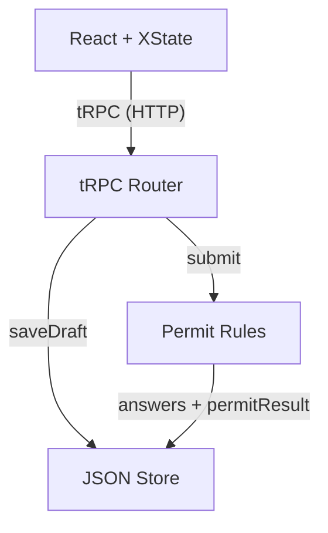
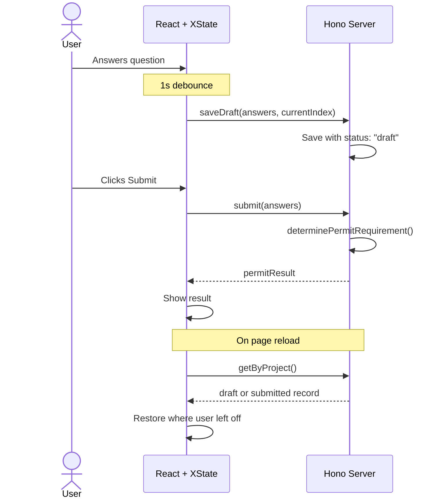

# Architecture

## System Overview

On submit, the router passes the user's answers + project location to `determinePermitRequirement()`, which returns one of three outcomes evaluated in priority order:

| Outcome           | Triggered by                                              |
| ----------------- | --------------------------------------------------------- |
| `in_house_review` | ADU, new bathroom/laundry, SF deck/garage, "other"        |
| `otc_review`      | Bathroom remodel, electrical, roof, garage+exterior doors |
| `no_permit`       | Everything else (flooring, fencing, single door)          |

The result is stored alongside the answers in a single record.

## Form Update Flow

## Key Tech Choices

**XState v5 for form state** -- The questionnaire has 6 states (idle, answering, submitting, submitted, reopening, deleting) with guards and timeouts. A state machine makes impossible states unrepresentable — you can't double-submit, navigate while a request is in-flight, or end up in a broken UI state.

**Single record for drafts and submissions** -- Rather than a separate drafts table, we added `status: "draft" | "submitted"` to the existing questionnaire record. One record per project, overwritten in place. Simpler model with no orphan cleanup, at the cost of not being able to keep a draft and a previous submission side by side.

## Tradeoffs

| Decision                                                  | Upside                                                        | Downside                                          |
| --------------------------------------------------------- | ------------------------------------------------------------- | ------------------------------------------------- |
| Debounced auto-save (1s)                                  | Saves progress without spamming the API                       | Up to 1s of work can be lost on crash             |
| Backend-authoritative permit logic                        | Single source of truth, can't be spoofed by client            | Extra round-trip on submit                        |
| Questionnaire as its own entity (not embedded in Project) | Clean separation, independent CRUD lifecycle                  | Extra query to fetch; must keep projectId in sync |
| saveDraft skips submitted records                         | Prevents trailing debounce from overwriting a real submission | Silent no-op could mask bugs                      |

## Future Improvements

- **Optimistic UI on draft save** -- Show a subtle "Saving..." / "Saved" indicator so users have confidence their work is persisted. Also pre-open a questionaire in a new project.
- **Versioned question definitions** -- Store the question schema version with each submission so permit logic can evolve without breaking historical records (backwards compatibility)
