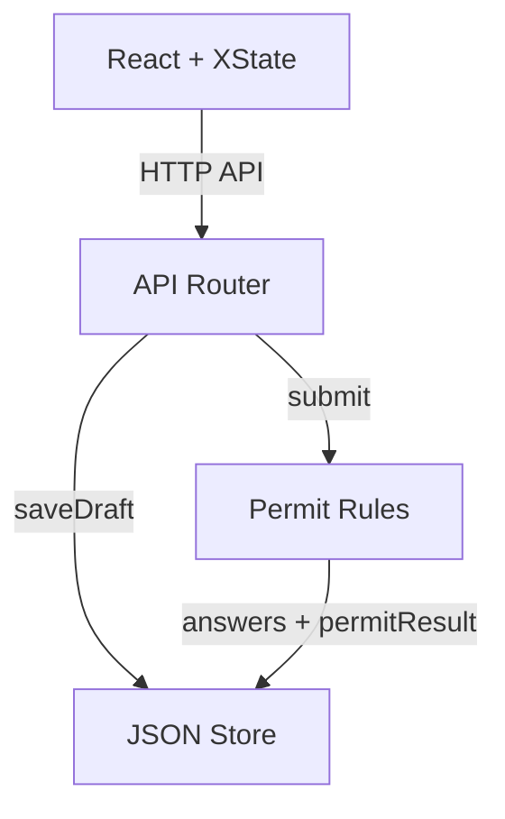
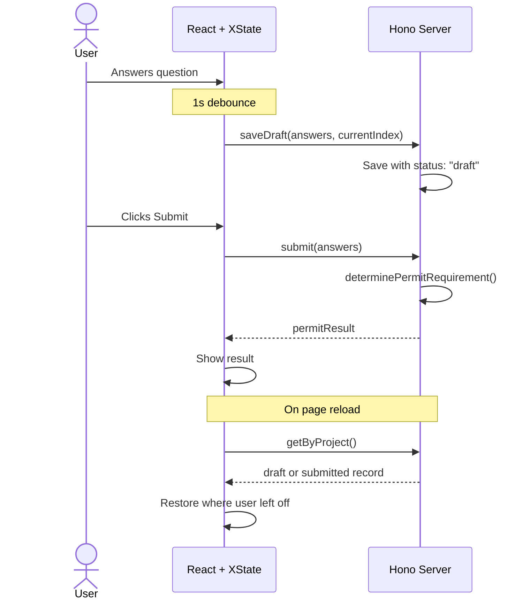

# Architecture

## System Overview

On submit, the router sends the answers and project location to `determinePermitRequirement()`. The rules run in priority order and return one of three outcomes:

| Outcome | Triggered by |
| --- | --- |
| `in_house_review` | ADU, new bathroom/laundry, SF deck/garage, "other" |
| `otc_review` | Bathroom remodel, electrical, roof, garage + exterior doors |
| `no_permit` | Everything else (flooring, fencing, single door) |

## Form Update Flow

## Key Decisions

- **XState v5 for form state**: The questionnaire uses 6 explicit states with guards and timeout recovery for in-flight mutations.
- **Debounced auto-save**: Drafts save 1 second after the last answer or navigation change. A submitted record is never downgraded back to a draft.
- **Backend-authoritative permit logic**: Permit outcomes are computed on the server, not inferred from client state.
- **Single questionnaire record per project**: The same record moves between `draft` and `submitted`, which keeps restore, edit, and delete paths simple.
