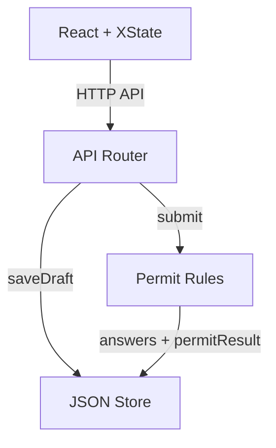

# Permit Scope

A multi-step questionnaire that determines building permit requirements for residential construction projects. Built to demonstrate **complex form state management** with XState, React Hook Form, and debounced auto-save.

## Quick Start

```bash
bun install
bun run dev
```

Open [http://localhost:6173](http://localhost:6173). Alternatively, open in a [devcontainer](.devcontainer/) for a zero-config setup.

## How It Works

Users create a project, answer a branching scope-of-work questionnaire, and receive one of three permit outcomes:

| Outcome | Triggered by |
| --- | --- |
| **In-House Review** | ADU, new bathroom/laundry, structural work in SF, "other" selections |
| **OTC Review** | Bathroom remodel, electrical, roof, garage + exterior doors combo |
| **No Permit** | Everything else |

Answers auto-save as drafts and survive page reloads. Submitted results can be edited or cleared.

## Architecture



See [ARCHITECTURE.md](ARCHITECTURE.md) for the form update sequence diagram and key design decisions.

## Form State Machine

The questionnaire uses an **XState v5 state machine** with 6 states:

```
idle → answering → submitting → submitted
                                  ↕ reopening
                                  ↕ deleting → idle
```

Guards prevent impossible transitions: no double-submit, no navigation mid-request, no trailing auto-save overwriting a real submission.

## Tech Stack

| Layer | Tech |
| --- | --- |
| **Frontend** | React 19, XState v5, React Hook Form, Tailwind CSS 4, shadcn/ui |
| **Backend** | Hono, Zod, Awilix DI, JSON file store |
| **Monorepo** | Bun, Turborepo |

## Project Structure

```
backend/
  app/
    logic/          # Permit determination rules
    router/         # API endpoints + tests
    schemas/        # Zod validation schemas
    stores/         # JSON file persistence
frontend/
  app/
    questionnaire/  # XState machine, form UI, API bridge
  src/
    components/     # shadcn/ui + animation components
    lib/            # API client, utilities
```
