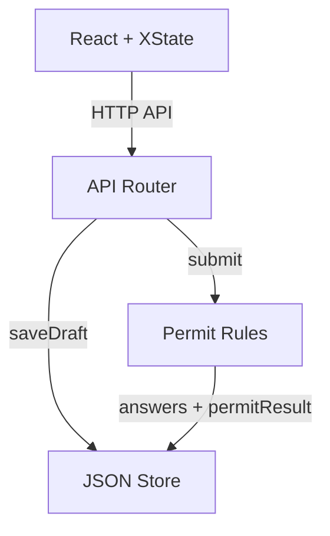

# Permit Scope

A small permitting app for residential construction projects. Users create a project, answer a branching questionnaire, and get a permit path based on their scope of work.

## Quick Start

```bash
bun install
bun run dev
bun test
```

Open [http://localhost:6173](http://localhost:6173).

If you prefer a containerized setup, the repo also includes a [devcontainer](.devcontainer/).

## How It Works

Each project stores one questionnaire. Answers branch the next questions, save as a draft, and can be restored on reload. Submission runs the permit rules on the backend and returns one of three outcomes:

| Outcome | Triggered by |
| --- | --- |
| **In-House Review** | ADU, new bathroom/laundry, structural work in SF, "other" selections |
| **OTC Review** | Bathroom remodel, electrical, roof, garage + exterior doors combo |
| **No Permit** | Everything else |

Submitted answers can be reopened for editing or cleared to start over.

## Architecture



See [ARCHITECTURE.md](ARCHITECTURE.md) for the request flow and design notes.

## Form State Machine

The questionnaire runs on an **XState v5** state machine with 6 explicit states:

```
idle → answering → submitting → submitted
                                  ↕ reopening
                                  ↕ deleting → idle
```

Guards and explicit transitions keep the form predictable: no next-step without an answer, no duplicate submit, and no trailing draft save overwriting a submitted record.

## Tech Stack

| Layer | Tech |
| --- | --- |
| **Frontend** | React 19, XState v5, React Hook Form, Tailwind CSS 4, shadcn/ui |
| **Backend** | Hono, Zod, Awilix DI, JSON file store |
| **Monorepo** | Bun, Turborepo |

## Project Structure

```
backend/
  app/
    logic/          # Permit determination rules
    router/         # API endpoints + tests
    schemas/        # Zod validation schemas
    stores/         # JSON file persistence
frontend/
  app/
    questionnaire/  # XState machine, form UI, API bridge
  src/
    components/     # shadcn/ui primitives and shared UI
    lib/            # API client, utilities
```
